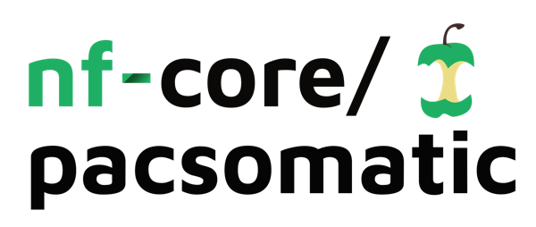

<h1>
  <picture>
    <source media="(prefers-color-scheme: dark)" srcset="docs/images/nf-core-pacsomatic_logo_dark.png">
    
  </picture>
</h1>

[](https://github.com/nf-core/pacsomatic/actions/workflows/ci.yml)
[](https://github.com/nf-core/pacsomatic/actions/workflows/linting.yml)[](https://nf-co.re/pacsomatic/results)[](https://doi.org/10.5281/zenodo.XXXXXXX)
[](https://www.nf-test.com)

[](https://www.nextflow.io/)
[](https://docs.conda.io/en/latest/)
[](https://www.docker.com/)
[](https://sylabs.io/docs/)
[](https://cloud.seqera.io/launch?pipeline=https://github.com/nf-core/pacsomatic)

[](https://nfcore.slack.com/channels/pacsomatic)[](https://twitter.com/nf_core)[](https://mstdn.science/@nf_core)[](https://www.youtube.com/c/nf-core)

## Introduction

**nf-core/pacsomatic** is a bioinformatics pipeline that use Pacbio HiFi Read data for somatic analysis. Specifically, **nf-core/pacsomatic** automatically pair the tumor/normal alignment, and proceed to a series of downstream somatic analysis including somatic variant calling(**SNV_INDEL/SV/CNV**) and annotation, tumor **clonality/purity** analysis, Homologous Recombination Deficiency(**HRD**) analsysis, methylation calling and Differential Methylation Region (**DMR**) detection and annotation. Such comparative studies of tumor/normal pairs can contribute to gain a deeper insights of cancer biology.
Built using Nextflow, the pipeline offers scalability, portability, and reproducibility across diverse computational infrastructures. Dependency management is simplified by employing containerization technologies such as Docker, Singularity, and Conda.

This pipeline utilizes the Nextflow DSL2 framework, featuring modularized processes with independent software environments, thereby making updates and maintenance straightforward. Processes are also integrated, whenever feasible, with the nf-core/modules repository to enhance usability and foster community contributions.

The schematic overview of the nf-core/pacsomatic workflow is shown below:
 
<p align="center">
    
</p>

## Pipeline Overview
Briefly, the `pacsomaric` pipeline performs the following major steps:
1.  Align reads ([`PBMM2`](https://github.com/PacificBiosciences/pbmm2))
2.  Sort and index alignments ([`SAMtools`](https://sourceforge.net/projects/samtools/files/samtools/))
3.  Choice of alignment QC a. ([`BAM_Coverage`](https://deeptools.readthedocs.io/en/develop/content/tools/bamCoverage.html)) b. ([`MosDepth`](https://github.com/brentp/mosdepth))
4.  Pacbio Germline SNV calling ([`Clair3`](https://github.com/HKU-BAL/Clair3))
5.  Pacbio variant phasing ([`HiPhase`](https://github.com/PacificBiosciences/HiPhase))
6.  Pacbio CpG methylation Call ([`pb_CpG_tools`](https://github.com/PacificBiosciences/pb-CpG-tools))
7.  Paired tumor_normal Differential Methylation Region detection ([`DSS_DMR`](https://forge.irstea.fr/chloe.cerutti/bsseqmethdiffanalysis/-/blob/main/DSS/DMR.R))
8.  Annotation of detected DMRs ([`DMR_ANNOT`](https://bioconductor.org/packages/release/bioc/html/annotatr.html))
9.  Pacbio Somatic SNV_INDEL calling ([`deepsomatic`](https://github.com/google/deepsomatic))
10. Pacbio Somatic SNV mutation signature ([`MutationalPatterns`](https://github.com/UMCUGenetics/MutationalPatterns))
11. Pacbio Somatic SNV annotation ([`VEP`](https://github.com/Ensembl/ensembl-vep))
12. Pacbio Somatic SV calling([`Severus`](https://github.com/KolmogorovLab/Severus))
13. Pacbio Somatic SV filtering ([`SVPack`](https://github.com/PacificBiosciences/svpack))
14. Pacbio Somatic SV annotation ([`AnnotSv`](https://github.com/lgmgeo/AnnotSV))
15. Homologous recombination deficiency ([`CHORD`](https://github.com/UMCUGenetics/CHORD))
16. Somatic CNV calling ([`CNVKit`](https://github.com/etal/cnvkit))
17. Tumor purity analysis substeps: a. ([`AMBER`](https://github.com/hartwigmedical/hmftools/tree/master/amber)) b.([`COBALT`](https://github.com/hartwigmedical/hmftools/tree/master/cobalt)) c.([`PURPLE`](https://github.com/hartwigmedical/hmftools/tree/master/purple))        
18. Read QC ([`FastQC`](https://www.bioinformatics.babraham.ac.uk/projects/fastqc/))
19. Present QC for raw reads ([`MultiQC`](http://multiqc.info/))

## Usage
 
> [!NOTE]
> If you are new to Nextflow and nf-core, please refer to [this page](https://nf-co.re/docs/usage/installation) on how to set-up Nextflow. Make sure to [test your setup](https://nf-co.re/docs/usage/introduction#how-to-run-a-pipeline) with `-profile test` before running the workflow on actual data.

First, prepare a samplesheet with your input data that looks as follows:

`samplesheet.csv`:

```csv
patient,sample,status,bam,pbi
ID1,S1_tumor,1,ID1_S1_tumor.bam,ID1_S1_tumor.bam.pbi
ID1,S1_normal,0,ID1_S1tumor.bam,ID1_S1_normal.bam.pbi
```

Note that the `.pbi` file is not required. If you choose not to include it, your input file might look like this:

```csv
patient,sample,status,bam
ID1,S1_tumor,1,ID1_S1_tumor.bam
ID1,S1_normal,0,ID1_S1tumor.bam
```
Each row represents one patient's tumor or normal' unaligned bam file and their associated index (optional).

Now, you can run the pipeline using:

<!-- TODO nf-core: update the following command to include all required parameters for a minimal example -->

```bash
nextflow run nf-core/pacsomatic \
   -profile <docker/singularity/.../institute> \
   --input samplesheet.csv \
   --outdir <OUTDIR>
```

> [!WARNING]
> Please provide pipeline parameters via the CLI or Nextflow `-params-file` option. Custom config files including those provided by the `-c` Nextflow option can be used to provide any configuration _**except for parameters**_; see [docs](https://nf-co.re/docs/usage/getting_started/configuration#custom-configuration-files).

For more details and further functionality, please refer to the [usage documentation](https://nf-co.re/pacsomatic/usage) and the [parameter documentation](https://nf-co.re/pacsomatic/parameters).

## Pipeline output

Pipeline results are organized into several sub-directories under the specified output directory (`<OUTDIR>`), structured by pac-somatic related biological functions:
- `<OUTDIR>/alignment_qc`: Result folder inlcuds aligned bams and alignment QC.
- `<OUTDIR>/somatic_snv_indel`: Result folder related to somatic SNV_INDEL, including somatic SNV_INDEL calling, mutational_signature analsysis, and the variant annotation of called somatic SNV_INDEL.
- `<OUTDIR>/somatic_sv`: Result folder related to somatic SV, including somatic SV calling, and variant annotation of called somatic SVs.
- `<OUTDIR>/somatic_cnv`: Result folder related to somatic CNV calling.
- `<OUTDIR>/methylation_cpg`:Result folder related to Pacbio methylation analysis, including the germline SNV calling, hiphasing, and pacbio CpG methylation calling, Differential Methylation Region(DMR) detection and annotation.
- `<OUTDIR>/hrd_estimation`: Result folder related to Homologous Recombination Deficiency(HRD), which include CHORD analyses.
- `<OUTDIR>/tumor_purity_ploid`: Result folder related to tumor clonality/purity analysis, including the run result folder from AMBER, COBALT and PURPLE.
- _(and more)_
 
To see the results of an example test run with a full size dataset refer to the [results](https://nf-co.re/pacsomatic/results) tab on the nf-core website pipeline page.
For more details about the output files and reports, please refer to the
[output documentation](https://nf-co.re/pacsomatic/output).

## Credits

nf-core/pacsomatic was originally written by Wenchao Zhang,Haidong Yi.

We thank the following people for their extensive assistance in the development of this pipeline:

<!-- TODO nf-core: If applicable, make list of people who have also contributed -->

## Contributions and Support

If you would like to contribute to this pipeline, please see the [contributing guidelines](.github/CONTRIBUTING.md).

For further information or help, don't hesitate to get in touch on the [Slack `#pacsomatic` channel](https://nfcore.slack.com/channels/pacsomatic) (you can join with [this invite](https://nf-co.re/join/slack)).

## Citations

<!-- TODO nf-core: Add citation for pipeline after first release. Uncomment lines below and update Zenodo doi and badge at the top of this file. -->
<!-- If you use nf-core/pacsomatic for your analysis, please cite it using the following doi: [10.5281/zenodo.XXXXXX](https://doi.org/10.5281/zenodo.XXXXXX) -->

<!-- TODO nf-core: Add bibliography of tools and data used in your pipeline -->

An extensive list of references for the tools used by the pipeline can be found in the [`CITATIONS.md`](CITATIONS.md) file.

You can cite the `nf-core` publication as follows:

> **The nf-core framework for community-curated bioinformatics pipelines.**
>
> Philip Ewels, Alexander Peltzer, Sven Fillinger, Harshil Patel, Johannes Alneberg, Andreas Wilm, Maxime Ulysse Garcia, Paolo Di Tommaso & Sven Nahnsen.
>
> _Nat Biotechnol._ 2020 Feb 13. doi: [10.1038/s41587-020-0439-x](https://dx.doi.org/10.1038/s41587-020-0439-x).
